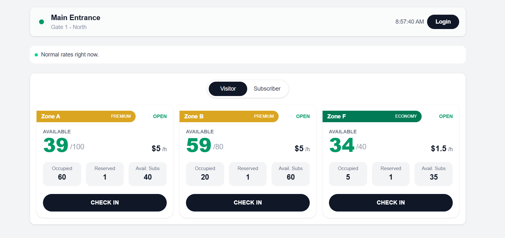
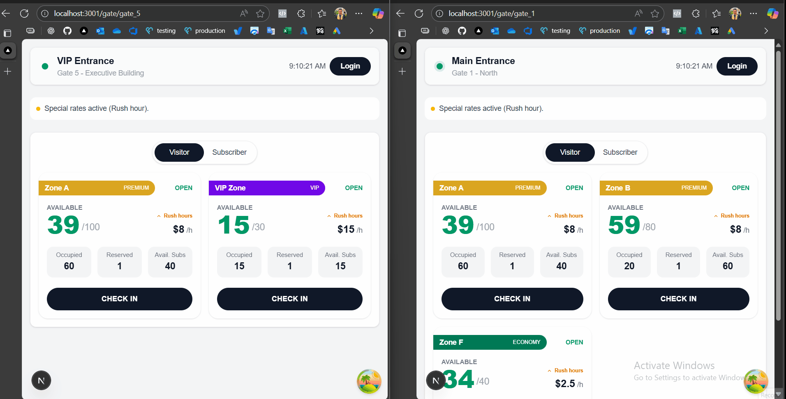
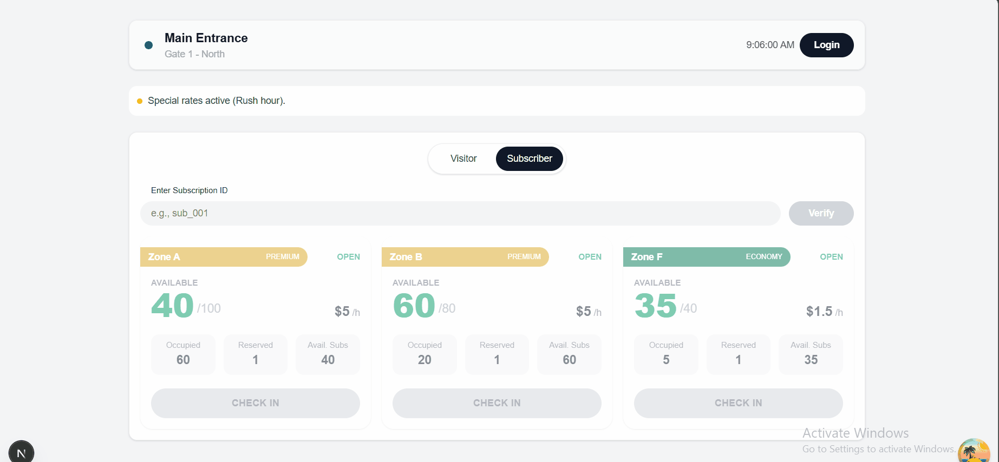
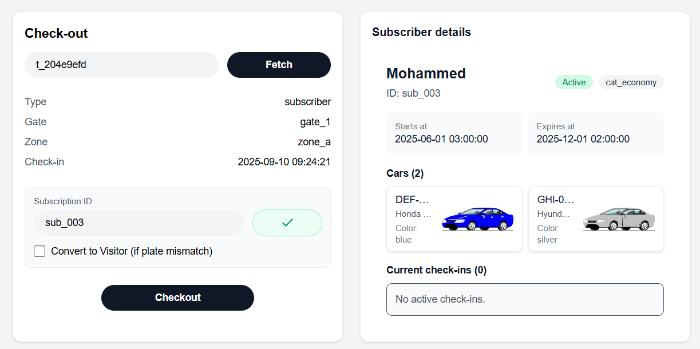
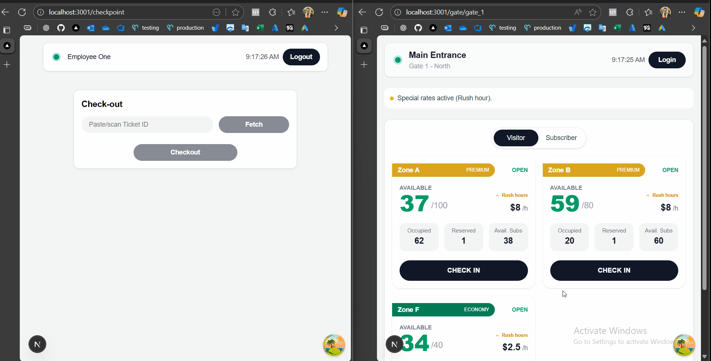
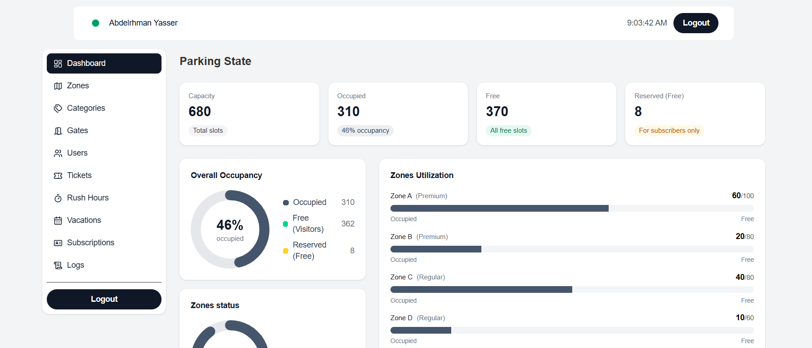
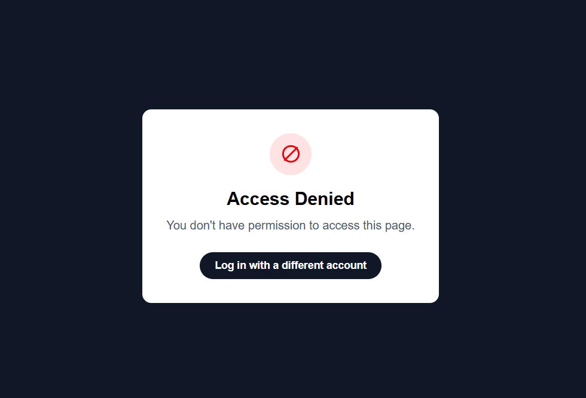
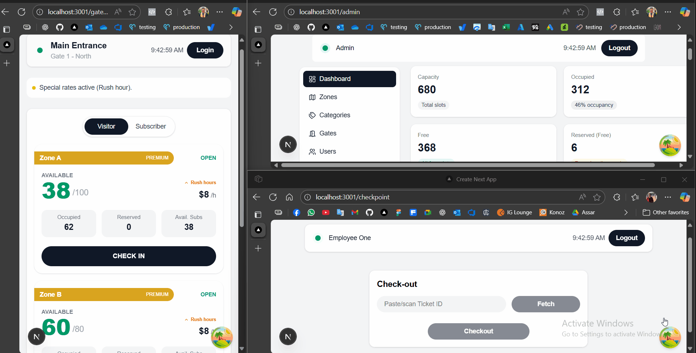

# Parking Reservation System — Frontend (Next.js)

A modern frontend for a Parking Reservation System with real-time updates, an operator “Gate” screen, and an Admin portal for live analytics and management.

> This repo contains only the frontend. A minimal mock backend is included for local development and WebSocket broadcasting.

---

## Run Locally

### 1) Start the backend

```bash
cd backend
npm install
npm start
```

### 2) Start the frontend (in another terminal)

```bash
cd frontend
npm install
npm run dev
```

### 3) Environment variables

#### Create a .env.local file in frontend with:

```env
NEXT_PUBLIC_API_BASE_URL=http://localhost:3000/api/v1
NEXT_PUBLIC_WS_URL=ws://localhost:3000/api/v1/ws
```



- You Can change the gate through the url
- You Can Navigate to Admin / Employee Pages by Clicking Login and and login with the users in the seed

---

## Features

- **Gate Screen** (`/gate/[gateId]`)
  - Live zone availability, visitor & subscriber flows
  - WebSocket “zone-update” pushes (instant UI updates)
    
  - Subscriber panel
    
  - Ability to print pdf ticket
---
- **Checkpoint Screen** (`/checkpoint`)
  1. **Lookup ticket (optional):** to prefill context before checkout.
  2. **Checkout & compute amount** 
  3. **Display breakdown:** Render segments (normal/special), per-hour rate, hours, and line totals, plus grand total and duration.
  4. **Subscriber context (if applicable):** If the ticket belongs to a subscriber (subscription id available), show the subscriber’s cars so the agent can visually compare plates.
  5. **Mismatch → Convert to Visitor:** If the plate doesn’t match or eligibility is invalid, allow **Convert to Visitor**

  6. **Confirmation & real-time update:** On success, show a confirmation and reflect the **zone occupancy change** instantly via WebSocket so Gate and Admin dashboards update in real time.
    
> **_NOTE:_**  I Added the Subscriber Id to the the ticket pdf so the employee can insert it manually because it doesn't exist in the ticket data
---
- **Admin Portal** (`/admin/*`)
  - **Dashboard** with KPIs & charts (occupancy, open/closed, utilization)
    
  - **Zones** CRUD (open/close toggle, gate assignment)
  - **Categories** CRUD (rate updates broadcast via WS)
  - **Gates** CRUD
  - **Users** create (admin/employee)
  - **Tickets** (checked-in / checked-out lists)
  - **Rush Hours** CRUD
  - **Vacations** CRUD
  - **Subscriptions** list + details modal + create/update
  - **Admin Logs** (live “admin-update” events via WS)
     
  > **_NOTE:_**  I Added Some Endpoints to server.js so that i can make fully fuctional admin portal
- **Auth & Session**
  - Cookie-based session (`ps_token`, `ps_role`, `ps_name`)
  
- **Data layer**
  - TanStack Query for fetching, caching, and targeted invalidations
  - WS-driven cache updates for real-time UX

- **UI**
  - Next.js (App Router), TypeScript, Tailwind CSS, lucide-react icons
  - Lightweight custom donuts/legends, responsive layout
  - Toast feedback for mutations & errors

---

## Tech Stack

- **Framework:** Next.js 14+, TypeScript
- **Data:** @tanstack/react-query
- **State (light):** Zustand (e.g., WS status, UI state)
- **Styling:** Tailwind CSS
- **Icons:** lucide-react
- **Tests:** Jest + React Testing Library
- **WS:** Native WebSocket (path: `/api/v1/ws` from mock backend)

---
